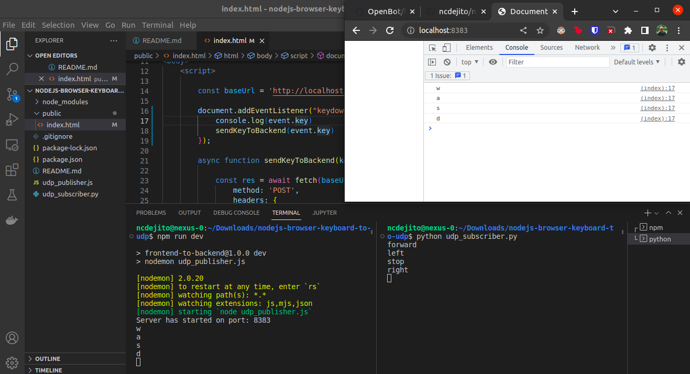

# nodejs-browser-keyboard-to-udp
Send browser keypresses to NodeJS backend, that sends messages to udp python



## Usage
1. In terminal 1, run 
```
npm run dev
```
1. In terminal 2, run 
```
python udp_subscriber.py
```
1. In browser, go to `http://localhost:8383/` then press wasd

## Tech Stack
* NodeJS
* Express
* UDP

## Source
* [Passing Data from Frontend to Backend](https://www.youtube.com/watch?v=5TxF9PQaq4U)
* [NodeJS UDP send](https://www.geeksforgeeks.org/node-js-socket-send-method/)